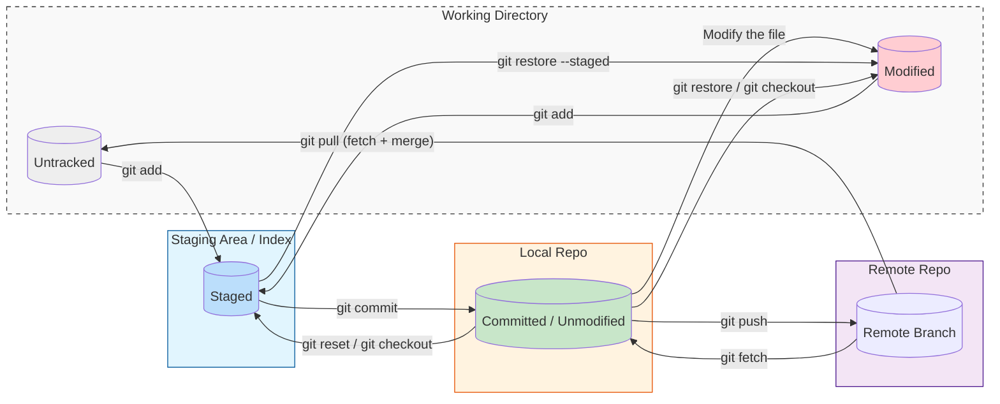

# Which

## Version Control

- Git
- Jujutsu https://github.com/jj-vcs/jj

## Platform

- Github
- Gitee
- Gitea
- Gitlab
- Bit Bucket

# Basic Concepts

## Work Area

| **Work Area**                     | **Map Location** | **How to interactive** |
| --------------------------------- | ---------------- | ---------------------- |
| Working Directory                 | `.git/..`        |                        |
| Staging Area / Index              | `.git/index`     | `git add`              |
| Local Repository / .git directory | `.git/objects`   | `git commit`           |
| Remote Repository                 |                  | `git push`, `git pull` |

## File Status

| **File Status** | **How to interactive** |
| --------------- | ---------------------- |
| Untracked       | New file               |
| Unmodified      |                        |
| Modified        |                        |
| Staged          | `git add`              |
| Committed       | `git commit`           |

```shell
# View the status of files in the current workspace and staging area
git status
```



## gitignore

```

```

## HEAD

```

```

## .git

```

```

# Conventional Commits

## Specification

- https://www.conventionalcommits.org/en/v1.0.0/

## IDE

- https://marketplace.visualstudio.com/items?itemName=adam-bender.commit-message-editor

## `squash` - Compress Commits

```shell

```

# Remote Repository

## `remote` - Link Local Repo with Remote Repo

```shell
git remote add origin git@github.com:time1043/food-delivery-form.git
git branch -M main
git push -u origin main
```

## Handling Conflicts with Remote Repo

```shell

```

# Branch

## `branch` - Create Branch and Sync Remote

```shell
git checkout -b readme
# git branch readme # create branch
# git checkout readme # switch branch

git add .
git commit -m "readme init"
git push -u origin readme
```

## `branch` - Delete Branch and Sync Remote

```shell
# git checkout main
git branch -d readme
git push origin --delete readme
```

## `branch` - Rename Branch and Sync Remote

```shell
# git checkout readme
git branch -m docs/readme  # rename
git push origin docs/readme
git push origin -u docs/readme  # link remote
git push origin --delete readme
```

## `checkout` - View Repositories that Have Been Committed in the past

```shell
# git log
git checkout zustand
git checkout 3d21  # detached HEAD - just view
```

# Branch Merage

##

```shell

```

# Stash

## `stash` - 📦

```shell
# Check what's in the storage
git stash list

# Bring last one back the work
git stash pop
git stash apply
# Clear All / specific
git stash clear
git stash drop stash@{0}
# Check
git stash list
git stash show
git stash show -p
```

## `worktree` - 📦

```shell

```

# Rollback: Restore, Reset, Revert, Rebase

## `restore` & `clean` - Discard All Change

```shell
# === Only work with files that are already managed by Git ===
# When only modify file
git restore .
# When already git add .
git restore --staged .
# Make the workspace look exactly the same as the last commit
git reset --hard HEAD

# === Some new files or folders were created and are "untracked" ===
# Check
git clean -n
# Force delete all untracked files
git clean -f
# Force delete all untracked files and folders
git clean -fd
```

## `reset` - Undo Commmit without New Commit ⛑️

```shell
# Save current unfinished work
# git stash

# Option 1: soft
# Undo commit and code still exists Staging Area (after git add)
git reset --soft HEAD~1
# Option 2: mixed - default
# Uodo commit and code still exists Working Directory (before git add)
git reset HEAD~1
# Option 3: hard
# Undo commit and remove code from computer
git reset --hard HEAD~1  # change history

# Abort: sync with remote repo
# git fetch origin
git reset --hard origin/react/react-router/data-mode

# Apply code
git cherry-pick -n 139a9ce8  # no commit

# Sync remote
git push -f origin main
```

## `revert` - Undo Commit within New Commit (Team)

```shell
git revert <commit-hash>

# If there is a conflict, it needs to be resolved manually
git revert --continue
```

## `rebase` - Modify the Previous Commit Code and Overwrite ⛑️

```shell
# If necessary, create a temporary branch backup
# git branch backup_stable

# Relative path / absolute path
# git rebase -i --root
# git rebase -i HEAD~2
git rebase -i e421
# q!  # if you need to exit (vim)
# pick -> edit  # if you need to modify (vim)
# git rebase --abort  # if you need to exit (terminal)

# After modify code ...
git add .
git commit --amend --no-edit  # overwrite
git rebase --continue

# If there is a conflict, it needs to be resolved manually
git add .
git rebase --continue

# Sync remote
git push origin zustand --force
```
